# 🚀 Omniverse Exec AI

<div align="center">


**AI 驅動的 Omniverse 自然語言執行平台**

</div>

## 🎯 專案概述

**Omniverse Exec AI** 是一個革命性的工具，讓您可以用自然語言直接控制 NVIDIA Omniverse。無需學習複雜的 API，只要描述您想要的操作，AI 就會自動生成並執行相應的 Python 代碼。

### ✨ 核心功能

```mermaid
graph LR
    A[自然語言輸入] --> B[AI 代碼生成]
    B --> C[安全檢查]
    C --> D[傳送到 Omniverse]
    D --> E[自動執行]
```



- 🧠 **智能代碼生成**：使用 Groq AI 將自然語言轉換為 Omniverse Python 代碼
- 🛡️ **安全檢查機制**：自動檢測危險操作，確保代碼安全執行
- 🚀 **即時執行**：通過 Extension 直接在 Omniverse 中執行生成的代碼
- 🎨 **直觀界面**：黑綠配色的專業界面，完美契合 Omniverse 風格

## 🏗️ 系統架構

```
┌─────────────────┐    ┌─────────────────┐    ┌─────────────────┐
│   Streamlit     │    │   FastAPI       │    │   Omniverse     │
│   前端界面       │◄──►│   後端隊列       │◄──►│   Extension     │
│                 │    │                 │    │                 │
│ • 自然語言輸入   │    │ • 代碼隊列管理   │    │ • 代碼執行      │
│ • AI 狀態顯示   │    │ • 執行歷史記錄   │    │ • 場景操作      │
│ • 代碼預覽      │    │ • 安全性驗證    │    │ • 結果反饋      │
└─────────────────┘    └─────────────────┘    └─────────────────┘
```

## 🚀 快速開始

### 📋 系統需求

- **作業系統**：Windows 10/11 (主要測試平台)
- **Python**：3.10+
- **Conda**：建議使用 Anaconda 或 Miniconda
- **Omniverse Kit**：用於執行生成的代碼
- **網路連接**：需要連接 Groq API

### ⚡ 一鍵啟動

1. **下載專案**
   ```bash
   git clone <repository-url>
   cd omniverse-exec-ai
   ```

2. **安裝依賴**
   ```bash
   conda create -n omniverse_exec_ai python=3.10
   conda activate omniverse_exec_ai
   pip install -r requirements.txt
   ```

3. **啟動系統**
   ```bash
   # Windows 用戶（推薦）
   start_omniverse_exec_ai.bat
   
   # 或手動啟動
   python fastapi_server.py  # 終端 1
   streamlit run streamlit_app.py  # 終端 2
   ```

4. **開始使用**
   - 📱 前端界面：http://localhost:8501
   - 📡 API 文檔：http://localhost:8000/docs

## 💡 使用指南

### 1️⃣ 輸入自然語言指令

在 Streamlit 界面中輸入您想要的操作，例如：

```
創建一個紅色立方體，放置在座標 (0, 0, 5)，並添加物理屬性
```

### 2️⃣ AI 自動生成代碼

系統會使用 Groq AI 生成對應的 Omniverse Python 代碼：

```python
import omni.kit.scripting
from pxr import UsdGeom, UsdShade, UsdPhysics

def create_red_cube_with_physics():
    # 獲取當前場景
    stage = omni.usd.get_context().get_stage()
    
    # 創建立方體
    cube_path = "/World/RedCube"
    cube = UsdGeom.Cube.Define(stage, cube_path)
    
    # 設置位置
    cube.GetPrim().GetAttribute("xformOp:translate").Set((0, 0, 5))
    
    # 創建紅色材質
    material = UsdShade.Material.Define(stage, "/World/Materials/RedMaterial")
    # ... 材質設定代碼 ...
    
    # 添加物理屬性
    UsdPhysics.RigidBodyAPI.Apply(cube.GetPrim())

create_red_cube_with_physics()
```

### 3️⃣ 安全檢查與執行

- ✅ **安全檢查通過**：代碼將顯示綠色邊框，可以安全執行
- ⚠️ **安全風險**：系統會警告並阻止執行危險代碼

### 4️⃣ 傳送到 Omniverse

點擊「🚀 傳送到 Omniverse」按鈕，代碼會自動傳送到 Omniverse Extension 執行。

## 🔧 高級功能

### 🎨 常用模板

側邊欄提供常用操作模板：
- 🟦 創建基本立方體
- ⚽ 創建帶物理的球體  
- 💡 添加場景光照
- 🎬 創建相機視角
- 🏠 創建簡單場景

### 🔍 狀態監控

實時顯示系統狀態：
- **AI 引擎狀態**：Groq API 連接狀況
- **Omniverse 連接**：FastAPI 後端狀況
- **執行隊列**：待執行代碼數量

### 🛠️ API 端點

FastAPI 後端提供完整的 API：

| 端點 | 方法 | 功能 |
|------|------|------|
| `/queue_code` | POST | 添加代碼到執行隊列 |
| `/next_code` | GET | 獲取下一個待執行代碼 |
| `/queue_status` | GET | 查看隊列狀態 |
| `/execution_history` | GET | 查看執行歷史 |

## 🛡️ 安全機制

### 代碼安全檢查

系統會檢查並阻止以下危險操作：
- 文件系統操作 (`open`, `os.system`)
- 系統命令執行 (`subprocess`)
- 動態代碼執行 (`exec`, `eval`)
- 惡意模組導入

### 執行隔離

- 代碼在受控環境中執行
- 僅允許安全的 Omniverse API
- 完整的執行記錄和錯誤追蹤

## 🔮 未來規劃

- [ ] **WebSocket 即時通信**：替代輪詢機制
- [ ] **Extension UI 增強**：更豐富的 Omniverse 界面
- [ ] **語音輸入支援**：語音轉文字功能
- [ ] **多語言支援**：支援更多自然語言
- [ ] **3D 預覽**：實時預覽生成結果

## 🤝 貢獻指南

歡迎貢獻代碼！請參考以下流程：

1. Fork 專案
2. 創建功能分支 (`git checkout -b feature/amazing-feature`)
3. 提交更改 (`git commit -m 'Add amazing feature'`)
4. 推送分支 (`git push origin feature/amazing-feature`)
5. 開啟 Pull Request

## 📄 授權條款

本專案採用 MIT 授權條款 - 詳見 [LICENSE](LICENSE) 檔案

## 🙏 致謝

- [NVIDIA Omniverse](https://www.nvidia.com/omniverse/) - 強大的 3D 協作平台
- [Groq](https://groq.ai/) - 高速 AI 推理引擎
- [Streamlit](https://streamlit.io/) - 優秀的 Python Web 應用框架
- [FastAPI](https://fastapi.tiangolo.com/) - 現代化的 Python API 框架

---

<div align="center">

**讓 AI 改變您使用 Omniverse 的方式**

[](https://github.com/your-org/omniverse-exec-ai)

</div> 